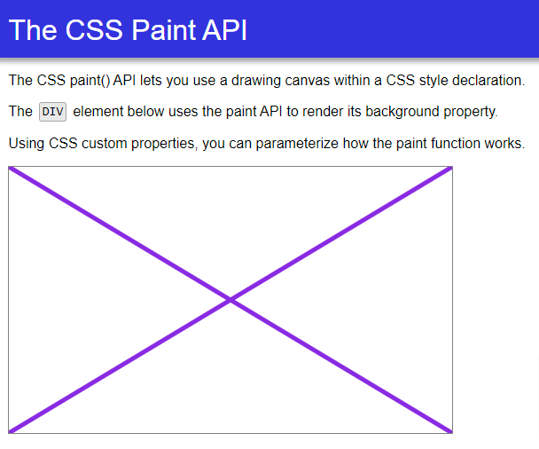

# Modern BrowserAPIs

## Front End Application

## LinkedIn:Learning Tutorial

[LinkedIn course](https://www.linkedin.com/learning/javascript-modern-browser-apis/building-apps-with-modern-javascript?autoplay=true)

## Purpose

Currently working on a front end project where I'm looking to implement some API's. I completed this course as it was short and introduced me to some possible modern browser API's.

## Author

[Joe Marini](https://www.linkedin.com/learning/instructors/joe-marini) was my instructor for this course. Any and all work is his. I simply followed along.

## Badges

